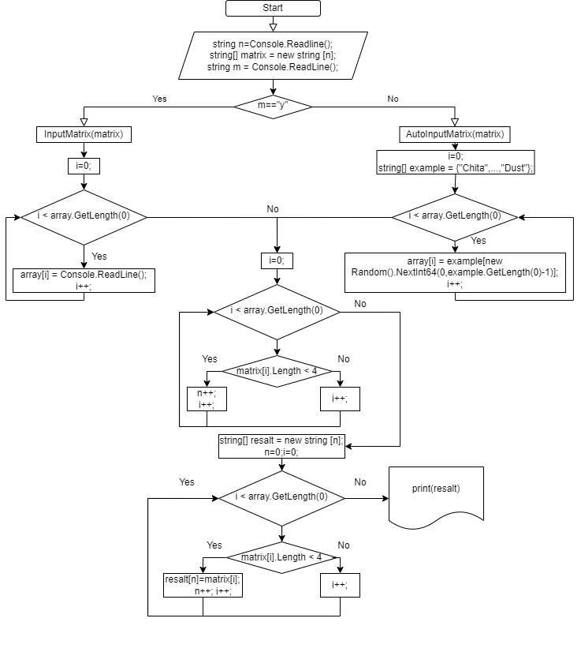

___

## Задание:
___
Написать программу, которая из имеющегося массива строк формирует массив из строк, длина которых меньше или равна 3 символам. Первоначальный массив можно ввести с клавиатуры, лабо задать на старте выполнения алгоритма.
___
Исходя из условия поставленной задачи выполнение программы происходит в следующей последовательности: 
1. Определение размерности массива.
2. Выбор условия заполнения строкового массива.
3. Проверка выполнения заданого условия элементами заполненного массива.
4. Заполнение нового массива элементами изначального массива, удовлетворяющими условию задания.
5. Вывод в терминал полученного массива.
___
На основе выбранной последовательности создём блок-схему исполнения программы:

___
Теперь рассмотрим детально последовательность работы программы по этапам.
1. Определение размерности массива.

В данном пункте по средствам работы с терминалом даём пользователю самому выбрать размерность предполагаемого массива.

2. Выбор условия заполнения строкового массива.

Далее  пользователю предоставляется выбор метода ввода элементов массива - самому ввести каждый отдельный элемент (вручную), либо воспользоваться автозаполнением массива путём случайного присвоения значений элементов зарание подготовленного строкового массива элементам генерируемого массива.

3. Проверка выполнения заданого условия элементами заполненного массива.

На этом шаге выполняеться проверка элементов сгенерированного массива на предмет выполнения поставленного условия с подсчётом кол-во элементов, удовлетворивших этому условию. После этого создаётся новый строковый массив, кол-во элементов которого равно кол-ву элементов, удовлетворивших условию задания.

4. Заполнение нового массива элементами изначального массива, удовлетворяющими условию задания.

На текущем шаге выполняеться последовательное заполнение созданного массива элементами сгенирированного массива, удовлетворяющими условию задания.

5. Вывод в терминал полученного массива.

И наконец путём циклического перебора выводим получившийся массив в терминал.
___